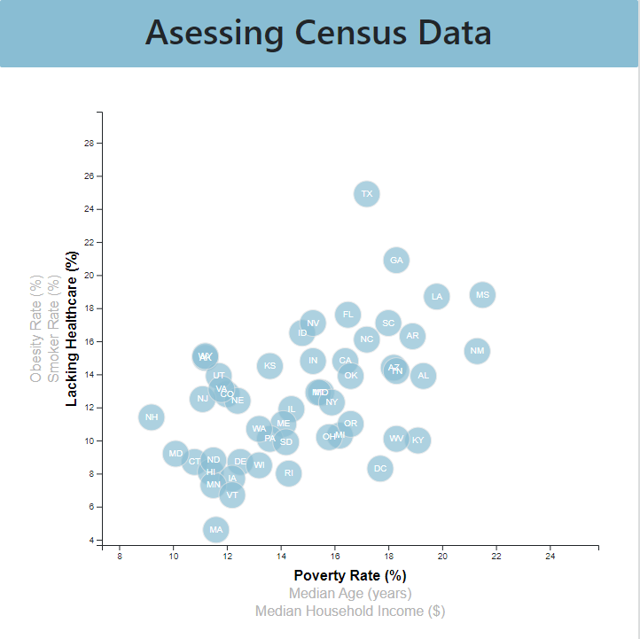

# D3 Homework - Data Journalism and D3

## Background

Welcome to the newsroom! I have just accepted a data visualisation position for a major metro paper. I am tasked with analysing the current trends shaping people's lives, as well as creating charts, graphs, and interactive elements to help readers understand your findings.

The editor wants to run a series of feature stories about the health risks facing particular demographics. She's counting on me to sniff out the first story idea by sifting through information from the U.S. Census Bureau and the Behavioural Risk Factor Surveillance System.

The data set included with the assignment is based on 2014 ACS 1-year estimates: [https://factfinder.census.gov/faces/nav/jsf/pages/searchresults.xhtml](https://factfinder.census.gov/faces/nav/jsf/pages/searchresults.xhtml). The current data set includes data on health and demographic indicators for each state, including:

* Median household income, 
* Obesity rates
* Smoking rates
* Access to healthcare
* Median age
* Poverty rates

## My Task

### Core Assignment: D3 Dabbler (Required Assignment)

I was tasked to create a scatter plot between two of the data variables such as `Healthcare vs. Poverty` or `Smokers vs. Age`.

Using the D3 techniques from my class, I created a scatter plot that represents each state with circle elements. I coded this graphic in the [app.js](assets/js/app.js) file.

### Bonus: Impress the Boss (Optional Assignment)

#### 1. More Data, More Dynamics

I included more demographics and more risk factors that the user can toggle between to show different correlations within the data.

#### 2. Incorporate d3-tip

While the ticks on the axes allow us to infer approximate values for each circle, it's impossible to determine the true value without adding another layer of data. Enter tooltips: developers can implement these in their D3 graphics to reveal a specific element's data when the user hovers their cursor over the element. Add tooltips to your circles and display each tooltip with the data that the user has selected. I used the `d3-tip.js` plugin developed by [Justin Palmer](https://github.com/Caged).
